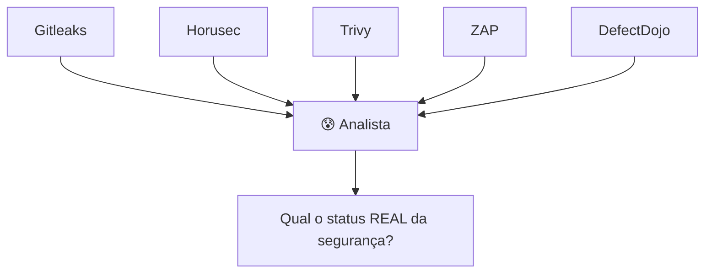
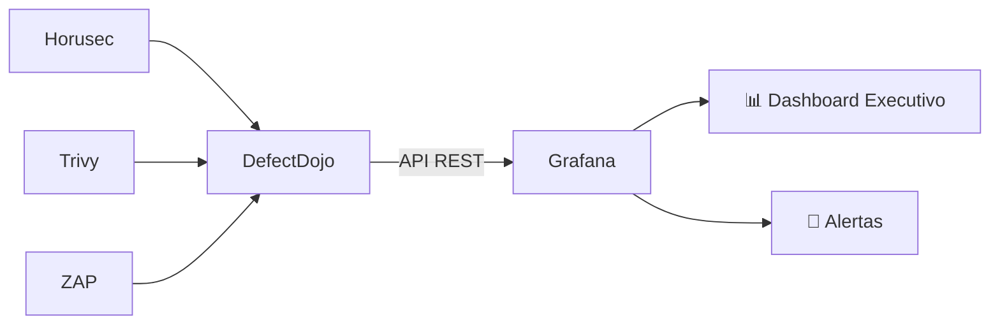

# 🎬 Vídeo 7.1 - Dashboard de Segurança com Grafana

**Aula**: 7 - Observabilidade e Maturidade  
**Vídeo**: 7.1  
**Temas**: Grafana; DefectDojo API; Dashboard de KPIs de Segurança; Painel Unificado

---

## 🚀 Antes de Começar

### Pré-requisitos

| Requisito | Como verificar |
|-----------|----------------|
| Docker instalado | `docker --version` |
| DefectDojo rodando (aula 06) | `http://localhost:8080` |
| Findings importados | Horusec, Trivy, ZAP no DefectDojo |

---

## 📚 Parte 1: Por que um Painel Unificado?

### Passo 1: O Problema



**DefectDojo resolve:**
- ✅ Centralizar findings
- ✅ Deduplicar vulnerabilidades
- ✅ Workflow de remediação

**DefectDojo NÃO resolve bem:**
- ❌ Dashboards executivos
- ❌ Tendências históricas
- ❌ Correlação com outras métricas (infra, CI/CD)
- ❌ Alertas customizados

---

### Passo 2: DefectDojo + Grafana = Melhor dos Dois Mundos



| Ferramenta | Quem usa | Para quê |
|------------|----------|----------|
| **DefectDojo** | Equipe AppSec | Trabalho diário (triagem, assign, close) |
| **Grafana** | Gestores, C-Level | Visão estratégica (KPIs, tendências, SLAs) |

---

### Passo 3: KPIs Essenciais de DevSecOps

| KPI | O que mede | Meta sugerida |
|-----|------------|---------------|
| **MTTD** | Mean Time to Detect | < 24h |
| **MTTR** | Mean Time to Remediate | Critical: 24h, High: 7d |
| **Vulnerability Backlog** | Vulns abertas | Tendência ↓ |
| **Critical Open** | Críticos não corrigidos | = 0 |
| **Findings by Tool** | Distribuição por scanner | Balanceado |

---

## 🐳 Parte 2: Setup do Ambiente

### Passo 4: Clone do Repositório

1. Acesse: `https://github.com/josenetoo/fiap-dclt-devsecops-aula07`
2. Clone:

**Linux/Mac:**
```bash
cd ~/fiap-devsecops
git clone https://github.com/josenetoo/fiap-dclt-devsecops-aula07.git
cd fiap-dclt-devsecops-aula07
```

---

### Passo 5: Iniciar Grafana

**Linux/Mac:**
```bash
cd ~/fiap-devsecops/fiap-dclt-devsecops-aula07/grafana

# Subir Grafana
docker-compose up -d

# Verificar
docker-compose ps
```

**Windows (PowerShell):**
```powershell
cd ~\projetos\fiap-dclt-devsecops-aula07\grafana
docker-compose up -d
docker-compose ps
```

---

### Passo 6: Acessar Grafana

1. Abra: http://localhost:3000
2. Login:
   - **Username**: `admin`
   - **Password**: `admin123`

---

### Passo 7: Verificar DefectDojo

Certifique-se que o DefectDojo está rodando:

```bash
# Se não estiver rodando, inicie-o (da aula 06)
cd ~/fiap-devsecops/fiap-dclt-devsecops-aula06/defectdojo
docker-compose up -d
```

Acesse: http://localhost:8080

---

## 🔌 Parte 3: Conectar Grafana ao DefectDojo

### Passo 8: Obter API Key do DefectDojo

1. DefectDojo > **API v2** (menu lateral)
2. Ou acesse: http://localhost:8080/api/key-v2
3. Copie sua **API Key**

> 💡 A API Key permite que o Grafana consulte os dados do DefectDojo

---

### Passo 9: Instalar Plugin Infinity no Grafana

O plugin **Infinity** permite conectar a APIs REST (como a do DefectDojo).

1. Grafana > **Administration** > **Plugins**
2. Busque: `Infinity`
3. Clique em **Install**

**Ou via linha de comando:**
```bash
docker exec -it grafana grafana-cli plugins install yesoreyeram-infinity-datasource
docker restart grafana
```

---

### Passo 10: Configurar Datasource DefectDojo

1. Grafana > **Connections** > **Data sources**
2. **Add data source** > **Infinity**
3. Configure:

| Campo | Valor |
|-------|-------|
| **Name** | `DefectDojo` |
| **Base URL** | `http://host.docker.internal:8080/api/v2` |

4. **Authentication** > **Headers**:
   - **Header**: `Authorization`
   - **Value**: `Token SEU_API_KEY_AQUI`

5. Clique **Save & Test**

> ⚠️ No Linux, use `http://172.17.0.1:8080/api/v2` ao invés de `host.docker.internal`

---

## 📊 Parte 4: Criar Dashboard de Segurança

### Passo 11: Criar Novo Dashboard

1. **Dashboards** > **New** > **New Dashboard**
2. Clique **Add visualization**

---

### Passo 12: Painel 1 - Total de Vulnerabilidades

**Configuração:**
- **Title**: `🔓 Total de Vulnerabilidades`
- **Datasource**: `DefectDojo`
- **Visualization**: `Stat`

**Query (Infinity):**
| Campo | Valor |
|-------|-------|
| **Type** | JSON |
| **Source** | URL |
| **Method** | GET |
| **URL** | `/findings/?limit=1` |

**JSONata/Fields:**
- **Field**: `count`
- **Type**: Number

---

### Passo 13: Painel 2 - Vulnerabilidades por Severidade

**Configuração:**
- **Title**: `📊 Por Severidade`
- **Visualization**: `Pie Chart`

**Query (Infinity):**
| Campo | Valor |
|-------|-------|
| **Type** | JSON |
| **URL** | `/findings/?limit=1000&active=true` |

**Transformações:**
1. **Group by**: `severity`
2. **Calculate**: Count

**Ou crie 4 queries separadas:**

| Query | URL | Label |
|-------|-----|-------|
| A | `/findings/?severity=Critical&active=true&limit=1` | Critical |
| B | `/findings/?severity=High&active=true&limit=1` | High |
| C | `/findings/?severity=Medium&active=true&limit=1` | Medium |
| D | `/findings/?severity=Low&active=true&limit=1` | Low |

Use o campo `count` de cada resposta.

---

### Passo 14: Painel 3 - Vulnerabilidades por Ferramenta

**Configuração:**
- **Title**: `🛠️ Por Ferramenta`
- **Visualization**: `Bar Chart`

**Queries:**

| Query | URL | Label |
|-------|-----|-------|
| A | `/findings/?test__test_type__name=Horusec&active=true&limit=1` | Horusec |
| B | `/findings/?test__test_type__name=Trivy&active=true&limit=1` | Trivy |
| C | `/findings/?test__test_type__name=ZAP&active=true&limit=1` | ZAP |

---

### Passo 15: Painel 4 - Críticos Abertos (Alerta!)

**Configuração:**
- **Title**: `🚨 Críticos Abertos`
- **Visualization**: `Stat`

**Query:**
| Campo | Valor |
|-------|-------|
| **URL** | `/findings/?severity=Critical&active=true&limit=1` |

**Thresholds:**
- 🟢 Green: 0
- 🔴 Red: > 0

> 💡 Este painel deve estar sempre VERDE (zero críticos abertos)

---

### Passo 16: Layout Final do Dashboard

```
┌─────────────────────────────────────────────────────────────┐
│  📊 DevSecOps Security Dashboard                            │
├────────────────────────┬────────────────────────────────────┤
│                        │                                    │
│  🔓 Total de Vulns     │  🚨 Críticos Abertos              │
│  ████████ 35           │  ████████ 0 ✅                    │
│                        │                                    │
├────────────────────────┼────────────────────────────────────┤
│                        │                                    │
│  📊 Por Severidade     │  🛠️ Por Ferramenta                │
│  🔴 Critical: 0        │  Horusec: 15 ████████             │
│  🟠 High: 8            │  Trivy: 12   ██████               │
│  🟡 Medium: 15         │  ZAP: 8      ████                 │
│  🟢 Low: 12            │                                    │
│                        │                                    │
└────────────────────────┴────────────────────────────────────┘
```

---

### Passo 17: Salvar Dashboard

1. Clique no ícone 💾 (Save)
2. Nome: `DevSecOps Security Dashboard`
3. Clique **Save**

---

## 🔔 Parte 5: Configurar Alertas

### Passo 18: Alerta de Critical > 0

**Cenário**: Alertar imediatamente se houver qualquer vulnerabilidade crítica aberta.

1. Edite o painel "Críticos Abertos"
2. Tab **Alert**
3. Configure:
   - **Condition**: `WHEN last() OF query IS ABOVE 0`
   - **Evaluate every**: `5m`
   - **For**: `0m`

4. **Notifications**:
   - Configure Slack, Email ou Teams

---

## 🔧 Troubleshooting

| Erro | Causa | Solução |
|------|-------|---------|
| Porta 3000 ocupada | Outro serviço | `docker-compose down` e mudar porta |
| `Connection refused` | DefectDojo não está rodando | Iniciar DefectDojo |
| `401 Unauthorized` | API Key inválida | Gerar nova API Key no DefectDojo |
| `host.docker.internal` não funciona | Linux | Usar `172.17.0.1` |

---

## ✅ Checkpoint

Ao final deste vídeo você deve ter:

- [ ] Grafana rodando localmente
- [ ] DefectDojo conectado como datasource
- [ ] Dashboard com 4+ painéis de segurança
- [ ] Dados REAIS das vulnerabilidades (Horusec, Trivy, ZAP)
- [ ] Entender a diferença entre DefectDojo e Grafana
- [ ] Saber configurar alertas

---

## 🎯 Valor Agregado

| Antes (só DefectDojo) | Depois (DefectDojo + Grafana) |
|-----------------------|-------------------------------|
| Dados operacionais | + Visão executiva |
| Sem histórico visual | + Tendências no tempo |
| Alertas básicos | + Alertas customizados |
| Uma ferramenta | + Painel unificado |

---

**FIM DO VÍDEO 7.1** ✅
