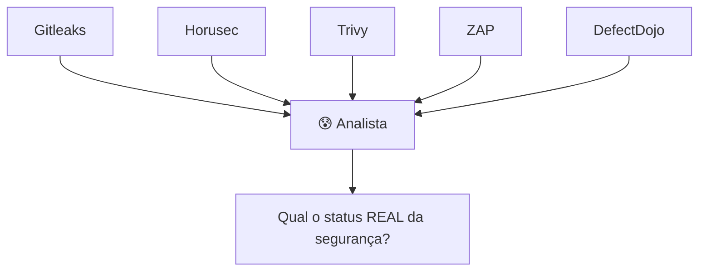
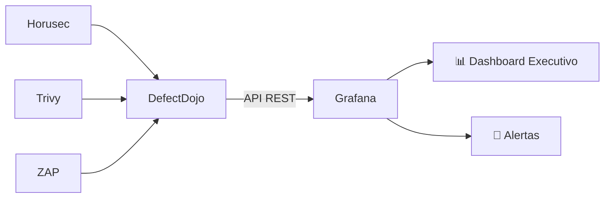

# 🎬 Vídeo 7.1 - Dashboard de Segurança com Grafana

**Aula**: 7 - Observabilidade e Maturidade  
**Vídeo**: 7.1  
**Temas**: Grafana; DefectDojo API; Dashboard de KPIs de Segurança; Painel Unificado

---

## 🚀 Antes de Começar

### Pré-requisitos

| Requisito | Como verificar |
|-----------|----------------|
| Docker instalado | `docker --version` |
| DefectDojo rodando (aula 06) | `http://localhost:8080` |
| Findings importados | Horusec, Trivy, ZAP no DefectDojo |

---

## 📚 Parte 1: Por que um Painel Unificado?

### Passo 1: O Problema



**DefectDojo resolve:**
- ✅ Centralizar findings
- ✅ Deduplicar vulnerabilidades
- ✅ Workflow de remediação

**DefectDojo NÃO resolve bem:**
- ❌ Dashboards executivos
- ❌ Tendências históricas
- ❌ Correlação com outras métricas (infra, CI/CD)
- ❌ Alertas customizados

---

### Passo 2: DefectDojo + Grafana = Melhor dos Dois Mundos



| Ferramenta | Quem usa | Para quê |
|------------|----------|----------|
| **DefectDojo** | Equipe AppSec | Trabalho diário (triagem, assign, close) |
| **Grafana** | Gestores, C-Level | Visão estratégica (KPIs, tendências, SLAs) |

---

### Passo 3: KPIs Essenciais de DevSecOps

| KPI | O que mede | Meta sugerida |
|-----|------------|---------------|
| **MTTD** | Mean Time to Detect | < 24h |
| **MTTR** | Mean Time to Remediate | Critical: 24h, High: 7d |
| **Vulnerability Backlog** | Vulns abertas | Tendência ↓ |
| **Critical Open** | Críticos não corrigidos | = 0 |
| **Findings by Tool** | Distribuição por scanner | Balanceado |

---

## 🐳 Parte 2: Setup do Ambiente

### Passo 4: Clone do Repositório

1. Acesse: `https://github.com/josenetoo/fiap-dclt-devsecops-aula07`
2. Clone:

**Linux/Mac:**
```bash
cd ~/fiap-devsecops
git clone https://github.com/josenetoo/fiap-dclt-devsecops-aula07.git
cd fiap-dclt-devsecops-aula07
```

**Windows (PowerShell):**
```powershell
cd ~\projetos
git clone https://github.com/josenetoo/fiap-dclt-devsecops-aula07.git
cd fiap-dclt-devsecops-aula07
```

---

### Passo 5: Verificar DefectDojo

Certifique-se que o DefectDojo está rodando:

```bash
# Se não estiver rodando, inicie-o (da aula 06)
cd ~/fiap-devsecops/fiap-dclt-devsecops-aula06/defectdojo
docker-compose up -d
```

Acesse: http://localhost:8080

---

### Passo 6: Obter API Key do DefectDojo

1. DefectDojo > **API v2** (menu lateral)
2. Ou acesse: http://localhost:8080/api/key-v2
3. Copie sua **API Key**

> 💡 A API Key permite que o Grafana consulte os dados do DefectDojo

---

### Passo 7: Configurar API Key no Grafana

Edite o arquivo de configuração do datasource:

**Linux/Mac:**
```bash
cd ~/fiap-devsecops/fiap-dclt-devsecops-aula07

# Abra o arquivo de configuração
nano grafana/provisioning/datasources/defectdojo.yml
```

**Substitua `SEU_API_KEY_AQUI` pelo token copiado:**

```yaml
secureJsonData:
  httpHeaderValue1: "Token abc123..."  # <- Cole seu token aqui
```

> ⚠️ **Linux**: Também altere `baseUrl` de `host.docker.internal` para `172.17.0.1`

---

### Passo 8: Iniciar Grafana

```bash
cd ~/fiap-devsecops/fiap-dclt-devsecops-aula07/grafana

# Subir Grafana (com dashboard pré-configurado!)
docker-compose up -d

# Verificar
docker-compose ps
```

---

### Passo 9: Acessar Grafana

1. Abra: http://localhost:3000
2. Login:
   - **Username**: `admin`
   - **Password**: `admin123`

---

## 📊 Parte 3: Explorar o Dashboard

### Passo 10: Visualizar Dashboard Pré-Configurado

O dashboard **DevSecOps Security Dashboard** já está disponível!

1. Grafana > **Dashboards**
2. Clique em **DevSecOps Security Dashboard**

---

### Passo 11: Painéis Disponíveis

O dashboard inclui 7 painéis:

| Painel | Tipo | O que mostra |
|--------|------|--------------|
| 🔓 Total de Vulnerabilidades | Stat | Contagem total de findings ativos |
| 🚨 Críticos Abertos | Stat | Alerta visual (verde = 0, vermelho > 0) |
| 🟠 High | Stat | Vulnerabilidades de alta severidade |
| 🟡 Medium | Stat | Vulnerabilidades de média severidade |
| 📊 Por Severidade | Pie Chart | Distribuição por criticidade |
| 🛠️ Por Ferramenta | Bar Chart | Distribuição por scanner (Horusec, Trivy, ZAP) |
| 📋 Últimas Vulnerabilidades | Tabela | Lista detalhada dos findings |

---

### Passo 12: Layout do Dashboard

```
┌─────────────────────────────────────────────────────────────┐
│  📊 DevSecOps Security Dashboard                            │
├──────────────┬──────────────┬──────────────┬───────────────┤
│ 🔓 Total     │ 🚨 Critical  │ 🟠 High      │ 🟡 Medium     │
│    35        │    0 ✅      │    8         │    15         │
├──────────────┴──────────────┼──────────────┴───────────────┤
│                             │                              │
│  📊 Por Severidade          │  🛠️ Por Ferramenta          │
│  [Pie Chart]                │  [Bar Chart]                 │
│                             │                              │
├─────────────────────────────┴──────────────────────────────┤
│  📋 Últimas Vulnerabilidades                               │
│  ┌──────────────────────────────────────────────────────┐  │
│  │ Title          │ Severity │ Component │ Created      │  │
│  │ SQL Injection  │ Critical │ api.py    │ 2024-01-15   │  │
│  │ XSS Reflected  │ High     │ index.js  │ 2024-01-14   │  │
│  └──────────────────────────────────────────────────────┘  │
└─────────────────────────────────────────────────────────────┘
```

---

## 🔧 Parte 4: Entender as Queries

### Passo 13: Como o Dashboard Funciona

O Grafana usa o **plugin Infinity** para consultar a API REST do DefectDojo.

**Exemplo de Query - Total de Vulnerabilidades:**

| Campo | Valor |
|-------|-------|
| **Type** | JSON |
| **Method** | GET |
| **URL** | `/findings/?active=true&limit=1` |
| **Parser** | JSONata: `count` |

**Resposta da API:**
```json
{
  "count": 35,
  "results": [...]
}
```

---

### Passo 14: Queries por Severidade

| Severidade | URL da API |
|------------|------------|
| Critical | `/findings/?active=true&severity=Critical&limit=1` |
| High | `/findings/?active=true&severity=High&limit=1` |
| Medium | `/findings/?active=true&severity=Medium&limit=1` |
| Low | `/findings/?active=true&severity=Low&limit=1` |

Cada query retorna o `count` de findings daquela severidade.

---

### Passo 15: Explorar a API do DefectDojo

Você pode explorar a API diretamente:

```bash
# Listar todos os findings (requer API Key)
curl -H "Authorization: Token SEU_TOKEN" \
  http://localhost:8080/api/v2/findings/?limit=5

# Contar Critical
curl -H "Authorization: Token SEU_TOKEN" \
  http://localhost:8080/api/v2/findings/?severity=Critical&limit=1
```

**Documentação completa**: http://localhost:8080/api/v2/doc/

---

## 🔔 Parte 5: Configurar Alertas

### Passo 16: Alerta de Critical > 0

**Cenário**: Alertar imediatamente se houver qualquer vulnerabilidade crítica aberta.

1. Edite o painel **🚨 Críticos Abertos**
2. Tab **Alert**
3. Configure:
   - **Condition**: `WHEN last() OF query IS ABOVE 0`
   - **Evaluate every**: `5m`
   - **For**: `0m`

4. **Notifications** (opcional):
   - Configure Slack, Email ou Teams

---

## 🎨 Parte 6: Customizar o Dashboard (Opcional)

### Passo 17: Adicionar Novo Painel

Se quiser adicionar painéis customizados:

1. Clique em **Add** > **Visualization**
2. Selecione datasource **DefectDojo**
3. Configure a query usando a API do DefectDojo

**Exemplos de queries úteis:**

| Métrica | URL |
|---------|-----|
| Findings por Produto | `/findings/?test__engagement__product=1&limit=1` |
| Findings Verificados | `/findings/?verified=true&limit=1` |
| Findings Falso Positivo | `/findings/?false_p=true&limit=1` |

---

### Passo 18: Salvar Alterações

1. Clique no ícone 💾 (Save)
2. Clique **Save**

---

## 🔧 Troubleshooting

| Erro | Causa | Solução |
|------|-------|---------|
| Porta 3000 ocupada | Outro serviço | `docker-compose down` e mudar porta |
| Dashboard sem dados | DefectDojo não está rodando | Iniciar DefectDojo |
| `401 Unauthorized` | API Key inválida | Verificar token em `defectdojo.yml` |
| `host.docker.internal` não funciona | Linux | Usar `172.17.0.1` no datasource |
| Plugin não encontrado | Grafana não baixou | `docker-compose down && docker-compose up -d` |

---

## ✅ Checkpoint

Ao final deste vídeo você deve ter:

- [ ] Grafana rodando localmente
- [ ] DefectDojo conectado como datasource
- [ ] Dashboard pré-configurado funcionando
- [ ] Dados REAIS das vulnerabilidades (Horusec, Trivy, ZAP)
- [ ] Entender a diferença entre DefectDojo e Grafana
- [ ] Saber explorar a API do DefectDojo
- [ ] Saber configurar alertas

---

## 🎯 Valor Agregado

| Antes (só DefectDojo) | Depois (DefectDojo + Grafana) |
|-----------------------|-------------------------------|
| Dados operacionais | + Visão executiva |
| Sem histórico visual | + Tendências no tempo |
| Alertas básicos | + Alertas customizados |
| Uma ferramenta | + Painel unificado |

---

## 📁 Arquivos do Repositório

```
grafana/
├── docker-compose.yml              # Container Grafana + Plugin Infinity
├── dashboards/
│   └── devsecops-dashboard.json    # Dashboard pré-configurado
└── provisioning/
    ├── datasources/
    │   └── defectdojo.yml          # Conexão com DefectDojo (editar token!)
    └── dashboards/
        └── default.yml             # Auto-provisioning
```

---

**FIM DO VÍDEO 7.1** ✅

---

## 📎 Anexo: Criar Dashboard Manualmente (Opcional)

> Esta seção é opcional. Use caso queira entender como criar o dashboard do zero, ou se o provisioning automático não funcionar.

### A1: Instalar Plugin Infinity Manualmente

1. Grafana > **Administration** > **Plugins**
2. Busque: `Infinity`
3. Clique em **Install**

**Ou via linha de comando:**
```bash
docker exec -it grafana grafana-cli plugins install yesoreyeram-infinity-datasource
docker restart grafana
```

---

### A2: Configurar Datasource Manualmente

1. Grafana > **Connections** > **Data sources**
2. **Add data source** > **Infinity**
3. Configure:

| Campo | Valor |
|-------|-------|
| **Name** | `DefectDojo` |
| **Base URL** | `http://host.docker.internal:8080/api/v2` |

4. **Authentication** > **Headers**:
   - **Header**: `Authorization`
   - **Value**: `Token SEU_API_KEY_AQUI`

5. Clique **Save & Test**

> ⚠️ No Linux, use `http://172.17.0.1:8080/api/v2` ao invés de `host.docker.internal`

---

### A3: Criar Dashboard Manualmente

1. **Dashboards** > **New** > **New Dashboard**
2. Clique **Add visualization**

---

### A4: Painel - Total de Vulnerabilidades

**Configuração:**
- **Title**: `🔓 Total de Vulnerabilidades`
- **Datasource**: `DefectDojo`
- **Visualization**: `Stat`

**Query (Infinity):**

| Campo | Valor |
|-------|-------|
| **Type** | JSON |
| **Source** | URL |
| **Method** | GET |
| **URL** | `/findings/?active=true&limit=1` |

**JSONata/Fields:**
- **Field**: `count`
- **Type**: Number

---

### A5: Painel - Vulnerabilidades por Severidade

**Configuração:**
- **Title**: `📊 Por Severidade`
- **Visualization**: `Pie Chart`

**Crie 4 queries:**

| Query | URL | Alias |
|-------|-----|-------|
| A | `/findings/?severity=Critical&active=true&limit=1` | Critical |
| B | `/findings/?severity=High&active=true&limit=1` | High |
| C | `/findings/?severity=Medium&active=true&limit=1` | Medium |
| D | `/findings/?severity=Low&active=true&limit=1` | Low |

Use o campo `count` de cada resposta (JSONata: `count`).

---

### A6: Painel - Críticos Abertos

**Configuração:**
- **Title**: `🚨 Críticos Abertos`
- **Visualization**: `Stat`

**Query:**

| Campo | Valor |
|-------|-------|
| **URL** | `/findings/?severity=Critical&active=true&limit=1` |
| **JSONata** | `count` |

**Thresholds:**
- 🟢 Green: 0
- 🔴 Red: > 0

---

### A7: Painel - Por Ferramenta

**Configuração:**
- **Title**: `🛠️ Por Ferramenta`
- **Visualization**: `Bar Chart`

**Queries:**

| Query | URL | Alias |
|-------|-----|-------|
| A | `/findings/?found_by=2&active=true&limit=1` | Horusec |
| B | `/findings/?found_by=3&active=true&limit=1` | Trivy |
| C | `/findings/?found_by=4&active=true&limit=1` | ZAP |

> 💡 Os IDs (2, 3, 4) podem variar. Consulte `/test_types/` na API.

---

### A8: Salvar Dashboard

1. Clique no ícone 💾 (Save)
2. Nome: `DevSecOps Security Dashboard`
3. Clique **Save**
