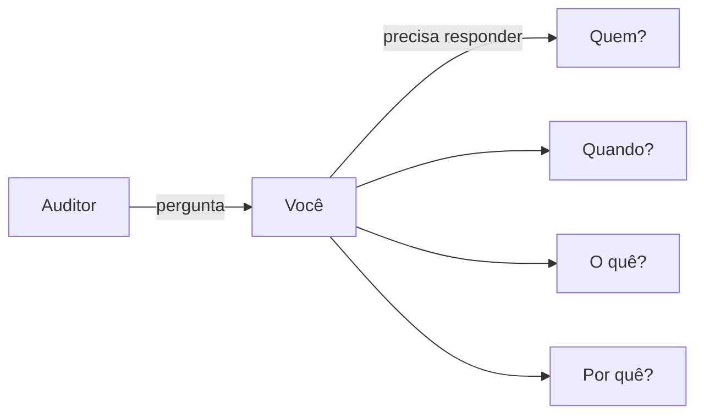
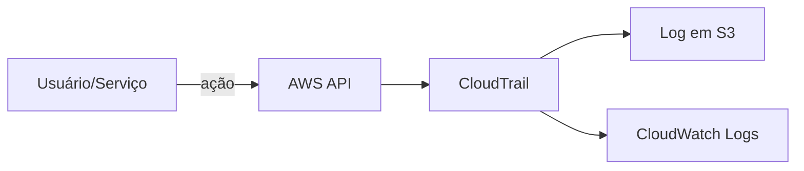
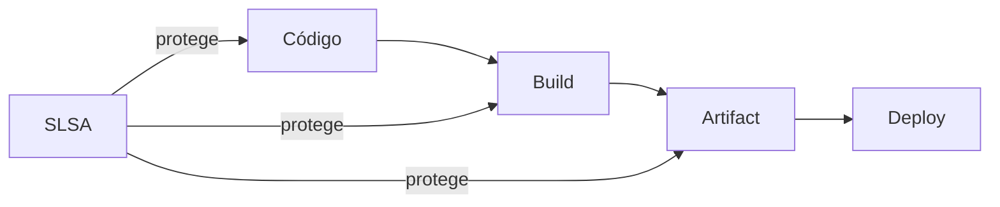

# 🎬 Vídeo 7.2 - Auditoria e Rastreabilidade

**Aula**: 7 - Observabilidade e Maturidade  
**Vídeo**: 7.2  
**Temas**: CloudTrail; GitHub Audit; SLSA Framework; Resposta a Auditoria

---

## 🚀 Antes de Começar

### Pré-requisitos

| Requisito | Como verificar |
|-----------|----------------|
| AWS CLI configurado | `aws sts get-caller-identity --profile fiapaws` |
| GitHub CLI (opcional) | `gh --version` |
| Repositório com histórico | Commits e PRs anteriores |

---

## 📚 Parte 1: O Cenário de Auditoria

### Passo 1: A Pergunta do Auditor

> 🔍 **"Quem aprovou o deploy da versão 1.2.3 em produção na terça-feira passada?"**



**Sem rastreabilidade**: 😰 "Deixa eu ver... acho que foi o João... ou era Maria?"

**Com rastreabilidade**: ✅ "Foi aprovado pelo João às 14:32, PR #47, após review da Maria"

---

### Passo 2: Fontes de Verdade

| Pergunta | Onde encontrar |
|----------|----------------|
| **Quem escreveu o código?** | Git commits |
| **Quem aprovou?** | Pull Request approvals |
| **Quando foi deployado?** | GitHub Actions logs |
| **O que mudou?** | Git diff, PR description |
| **Quem acessou a AWS?** | CloudTrail |

---

## 🔍 Parte 2: Auditoria no GitHub

### Passo 3: Rastrear pelo Git Log

**Linux/Mac:**
```bash
cd ~/fiap-devsecops/aula01-pipeline

# Ver últimos commits com autor e data
git log --oneline -10

# Ver commits de um autor específico
git log --author="joao" --oneline

# Ver commits em um período
git log --since="2024-01-01" --until="2024-01-31" --oneline

# Ver detalhes de um commit específico
git show abc1234
```

---

### Passo 4: Rastrear Pull Requests

**Via GitHub Web:**
1. Repositório > **Pull requests** > **Closed**
2. Clique no PR
3. Veja:
   - **Author**: Quem criou
   - **Reviewers**: Quem revisou
   - **Approvals**: Quem aprovou
   - **Merge commit**: Hash do merge

**Via GitHub CLI:**
```bash
# Listar PRs merged
gh pr list --state merged --limit 10

# Ver detalhes de um PR
gh pr view 47
```

---

### Passo 5: Rastrear Workflow Runs

**Via GitHub Web:**
1. Repositório > **Actions**
2. Clique em um workflow run
3. Veja:
   - **Triggered by**: Quem/o que iniciou
   - **Commit**: Qual commit
   - **Duration**: Quanto tempo
   - **Logs**: Output completo

**Via GitHub CLI:**
```bash
# Listar runs recentes
gh run list --limit 10

# Ver detalhes de um run
gh run view 123456789
```

---

### Passo 6: Cenário Prático - Responder Auditoria

**Pergunta**: "Quem deployou a versão com a vulnerabilidade corrigida?"

**Resposta passo a passo:**

```bash
# 1. Encontrar o commit da correção
git log --grep="fix" --oneline
# Resultado: abc1234 fix: corrigir SQL injection

# 2. Ver quem fez o commit
git show abc1234 --format="%an <%ae> - %ad"
# Resultado: João Silva <joao@empresa.com> - Mon Jan 15 14:32:00 2024

# 3. Encontrar o PR
gh pr list --search "abc1234" --state merged
# Resultado: PR #47 - Fix SQL Injection

# 4. Ver quem aprovou
gh pr view 47 --json reviews
# Resultado: Approved by Maria Santos

# 5. Ver quando foi deployado
gh run list --workflow=deploy.yml --limit 5
# Resultado: Run #89 - Jan 15 15:00 - Success
```

**Resposta final para o auditor:**
> "A correção foi feita por João Silva (commit abc1234), aprovada por Maria Santos (PR #47), e deployada às 15:00 do dia 15/01 (workflow run #89)."

---

## ☁️ Parte 3: Auditoria na AWS com CloudTrail

### Passo 7: O que é CloudTrail?

**CloudTrail** = Registro de TODAS as ações na AWS



**Registra:**
- Quem (usuário/role)
- O quê (API call)
- Quando (timestamp)
- De onde (IP, user agent)
- Resultado (sucesso/falha)

---

### Passo 8: Consultar CloudTrail

**Via Console:**
1. AWS Console > CloudTrail
2. **Event history**
3. Filtrar por:
   - Event name
   - User name
   - Time range

**Via CLI:**
```bash
# Eventos das últimas 24h
aws cloudtrail lookup-events \
  --start-time $(date -u -v-1d +%Y-%m-%dT%H:%M:%SZ) \
  --profile fiapaws \
  --region us-east-1

# Filtrar por evento específico
aws cloudtrail lookup-events \
  --lookup-attributes AttributeKey=EventName,AttributeValue=PushImage \
  --profile fiapaws \
  --region us-east-1
```

---

### Passo 9: Eventos Importantes para Auditoria

| Evento | Significado | Atenção |
|--------|-------------|---------|
| `ConsoleLogin` | Login no console AWS | Verificar horários suspeitos |
| `CreateUser` | Novo usuário IAM | Quem criou? |
| `PushImage` | Push para ECR | Quem deployou? |
| `UpdateService` | Atualização ECS | Mudança em produção |
| `CreateAccessKey` | Nova access key | Possível vazamento |

---

### Passo 10: Cenário - Quem fez push da imagem?

```bash
# Buscar eventos de push para ECR
aws cloudtrail lookup-events \
  --lookup-attributes AttributeKey=EventName,AttributeValue=PutImage \
  --profile fiapaws \
  --region us-east-1 \
  --query 'Events[0]' | jq '.'
```

**Resultado:**
```json
{
  "EventTime": "2024-01-15T15:00:00Z",
  "EventName": "PutImage",
  "Username": "github-actions-role",
  "SourceIPAddress": "140.82.xxx.xxx",
  "Resources": [
    {
      "ResourceName": "devsecops-app",
      "ResourceType": "AWS::ECR::Repository"
    }
  ]
}
```

---

## 🔐 Parte 4: SLSA Framework

### Passo 11: O que é SLSA?

**SLSA** = Supply-chain Levels for Software Artifacts  
(Pronuncia-se "salsa")

> 🎯 **O que é?** SLSA é um **framework de segurança** que define práticas para proteger sua cadeia de software contra adulterações. Não é uma ferramenta nem um relatório — é um conjunto de **níveis de maturidade** que garantem que o artefato final (container, binário) realmente veio do código-fonte que você escreveu.

> 💡 **Por que importa?** Ataques como SolarWinds (2020) mostraram que hackers podem injetar código malicioso durante o build, sem tocar no repositório. SLSA protege exatamente esse ponto.

**Objetivo**: Garantir integridade da cadeia de software



---

### Passo 12: Níveis SLSA

| Nível | Requisitos | O que garante |
|-------|------------|---------------|
| **SLSA 1** | Build documentado | Sabe como foi buildado |
| **SLSA 2** | Build verificável + logs retidos | Pode provar como foi buildado |
| **SLSA 3** | Build isolado/hermético | Ninguém adulterou o build |
| **SLSA 4** | 2 revisores + reproduzível | Máxima confiança |

---

### Passo 13: Provenance - O Certificado de Origem

**Provenance** = Documento que prova origem do artifact

```json
{
  "_type": "https://in-toto.io/Statement/v0.1",
  "subject": [{
    "name": "devsecops-app",
    "digest": { "sha256": "abc123..." }
  }],
  "predicate": {
    "builder": { "id": "https://github.com/actions/runner" },
    "buildType": "https://github.com/slsa-framework/...",
    "invocation": {
      "configSource": {
        "uri": "git+https://github.com/user/repo@refs/heads/main",
        "digest": { "sha1": "def456..." }
      }
    }
  }
}
```

**O que isso prova:**
- ✅ Artifact `devsecops-app` com hash `abc123`
- ✅ Buildado pelo GitHub Actions
- ✅ A partir do commit `def456` do branch `main`

---

### Passo 14: Implementar SLSA no GitHub Actions

Adicionar ao workflow:

```yaml
jobs:
  build:
    permissions:
      id-token: write       # Para OIDC
      contents: read
      attestations: write   # Para provenance
    
    steps:
      - uses: actions/checkout@v4
      
      - name: Build
        run: docker build -t app:${{ github.sha }} .
      
      - name: Generate Provenance
        uses: slsa-framework/slsa-github-generator/.github/workflows/generator_container_slsa3.yml@v1.9.0
        with:
          image: app:${{ github.sha }}
```

---

## 🔧 Troubleshooting

| Erro | Causa | Solução |
|------|-------|---------|
| CloudTrail vazio | Filtro muito restritivo | Ampliar time range |
| `gh` não autenticado | Token expirado | `gh auth login` |
| SLSA falha | Permissões faltando | Adicionar `id-token: write` |

---

**FIM DO VÍDEO 7.2** ✅
