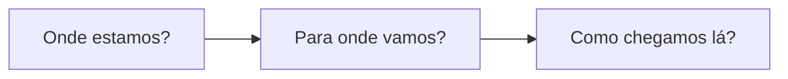
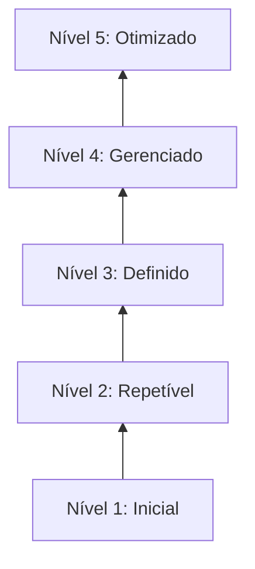
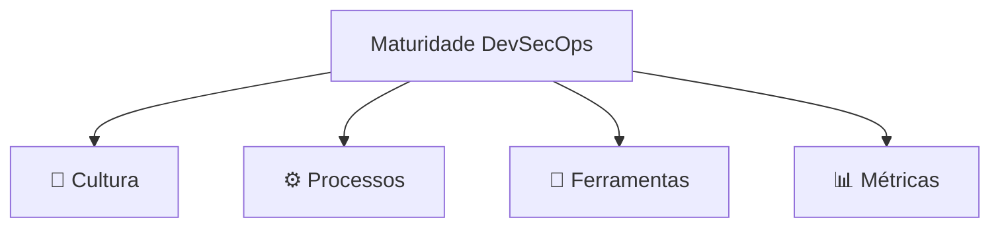

# 🎬 Vídeo 7.3 - Roadmap de Maturidade DevSecOps

**Aula**: 7 - Observabilidade e Maturidade  
**Vídeo**: 7.3  
**Temas**: Modelo de Maturidade; Autoavaliação; Roadmap de Adoção; Próximos Passos

---

## 🚀 Antes de Começar

Este vídeo é **conceitual + autoavaliação**. Não precisa de ambiente, apenas reflexão!

---

## 📚 Parte 1: Modelo de Maturidade DevSecOps

### Passo 1: Por que Medir Maturidade?

**Benefícios:**
- Linguagem comum com a gestão
- Identificar gaps
- Priorizar investimentos
- Medir progresso

---

### Passo 2: Os 5 Níveis de Maturidade

| Nível | Nome | Característica |
|-------|------|----------------|
| **1** | Inicial | Ad hoc, heróis, sem padrão |
| **2** | Repetível | Processos básicos documentados |
| **3** | Definido | Padrões organizacionais |
| **4** | Gerenciado | Métricas e feedback contínuo |
| **5** | Otimizado | Melhoria contínua, inovação |

---

### Passo 3: Dimensões da Maturidade

---

## 📋 Parte 2: Autoavaliação

### Passo 4: Checklist de Maturidade

**Preencha mentalmente (ou em papel) onde sua organização está:**

---

#### 👥 CULTURA

| Prática | N1 | N2 | N3 | N4 | N5 |
|---------|----|----|----|----|---|
| Treinamento DevSecOps | ❌ Nenhum | 📅 Anual | 🔄 Contínuo | 🎯 Por role | 🚀 Certificações |
| Security Champions | ❌ Não existe | 👤 1 pessoa | 👥 Por time | 🌐 Comunidade | 🏆 Programa formal |
| Colaboração Dev-Sec | 🚫 Silos | 📧 Email | 🤝 Reuniões | 💬 Integrado | 🎯 Shift-Left total |
| Ownership de segurança | 🏃 Só Sec | ⚠️ Compartilhado | ✅ Dev assume | 🎯 Métricas por time | 🏆 Gamificação |

---

#### ⚙️ PROCESSOS

| Prática | N1 | N2 | N3 | N4 | N5 |
|---------|----|----|----|----|---|
| **Secret Scanning** | ❌ Não | 🔍 Manual | 🤖 CI/CD | 🚫 Blocking | 🔄 + Rotation |
| **SAST** | ❌ Não | 🔍 Manual | 🤖 CI/CD | 🚫 Blocking | 📊 Trend analysis |
| **SCA** | ❌ Não | 🔍 Manual | 🤖 CI/CD | 🚫 Blocking + SBOM | 🔄 Auto-fix |
| **Container Scan** | ❌ Não | 🔍 Build time | 🤖 Registry | 🚫 Blocking | 🛡️ Runtime |
| **DAST** | ❌ Nunca | 📅 Anual | 🔄 Release | 🤖 CI/CD | 🔄 Contínuo |
| **IaC Security** | ❌ Não | 🔍 Manual | 🤖 CI/CD | 🚫 Blocking | 📜 Policy as Code |

---

#### 🔧 FERRAMENTAS

| Prática | N1 | N2 | N3 | N4 | N5 |
|---------|----|----|----|----|---|
| Centralização | 📊 Excel | 🛠️ Uma ferramenta | 🎯 DefectDojo | 🔗 Integrado SIEM | 🤖 Auto-triage |
| Automação | ❌ Manual | 📝 Scripts | 🤖 CI/CD | 🔄 GitOps | 🧠 AI/ML |
| Alertas | ❌ Nenhum | 📧 Email | 💬 Slack | 📟 PagerDuty | 🎯 Smart routing |

---

#### 📊 MÉTRICAS

| Prática | N1 | N2 | N3 | N4 | N5 |
|---------|----|----|----|----|---|
| MTTD tracking | ❌ Não | 📊 Manual | 🤖 Automático | 📈 Dashboards | 🎯 SLA |
| MTTR tracking | ❌ Não | 📊 Manual | 🤖 Automático | 📈 Dashboards | 🎯 SLA + alerts |
| Vulnerability trend | ❌ Não | 📊 Mensal | 📈 Semanal | ⏱️ Real-time | 📉 Predictive |
| Coverage % | ❌ Desconhecido | 📊 Estimado | 🎯 Medido | 📈 Por time | 🏆 Gamificado |

---

### Passo 5: Calcule seu Nível

**Some os pontos:**
- Maioria em N1-N2: **Nível 1-2** (Inicial/Repetível)
- Maioria em N2-N3: **Nível 2-3** (Repetível/Definido)
- Maioria em N3-N4: **Nível 3-4** (Definido/Gerenciado)
- Maioria em N4-N5: **Nível 4-5** (Gerenciado/Otimizado)

---

## 🚀 Parte 3: Próximos Passos

### Passo 6: Sugestões de Ferramentas

| Ferramenta/Conceito | O que faz | Quando usar |
|---------------------|-----------|-------------|
| **AWS Security Hub** | Centraliza findings AWS | Multi-account, compliance |
| **AWS GuardDuty** | Detecção de ameaças ML | Runtime security |
| **Falco** | Runtime container security | Kubernetes/ECS |
| **Snyk** | SCA comercial | Alternativa ao Trivy com fix automático |
| **Semgrep** | SAST customizável | Regras específicas da empresa |
| **IAST** | Teste em runtime | Menos falsos positivos |
| **Threat Modeling** | Design seguro | Antes de codificar |

---

## ✅ Checkpoint

Ao final deste vídeo você deve:

- [ ] Entender os 5 níveis de maturidade
- [ ] Ter feito autoavaliação da sua organização
- [ ] Conhecer as 4 dimensões (Cultura, Processos, Ferramentas, Métricas)
- [ ] Ter um plano de próximos passos
- [ ] Conhecer ferramentas para evoluir

---

## 📖 Leitura Complementar

- [OWASP SAMM](https://owaspsamm.org/) - Software Assurance Maturity Model
- [BSIMM](https://www.bsimm.com/) - Building Security In Maturity Model
- [SLSA Framework](https://slsa.dev/)
- [NIST SSDF](https://csrc.nist.gov/Projects/ssdf) - Secure Software Development Framework

---

**FIM DO VÍDEO 7.3 E DA DISCIPLINA** ✅ 🎉
