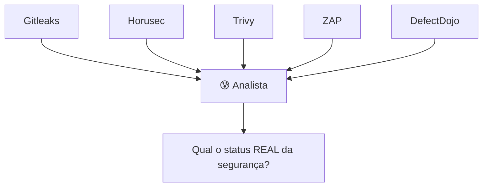
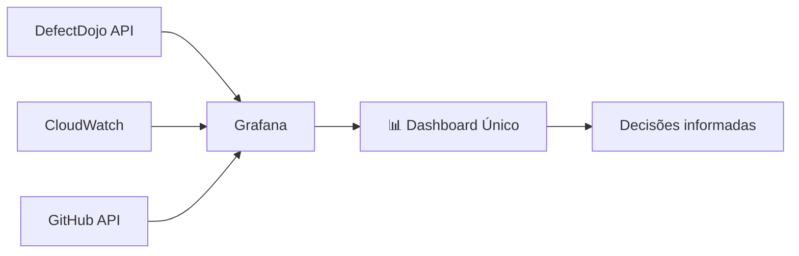

# 🎬 Vídeo 7.1 - Dashboard de Segurança com Grafana

**Aula**: 7 - Observabilidade e Maturidade  
**Vídeo**: 7.1  
**Temas**: Grafana; CloudWatch; Dashboard de KPIs de Segurança; Métricas de WAF

---

## 🚀 Antes de Começar

### Pré-requisitos

| Requisito | Como verificar |
|-----------|----------------|
| Docker instalado | `docker --version` |
| AWS CLI configurado | `aws sts get-caller-identity --profile fiapaws` |
| Sessão Learner Lab ativa | 🟢 no console |

### Opcional (enriquece a experiência)
- DefectDojo rodando (aula 06) para métricas reais de vulnerabilidades

---

## 📚 Parte 1: Por que Visualizar Segurança?

### Passo 1: O Problema



**Perguntas difíceis de responder:**
- Estamos melhorando ou piorando?
- Qual time tem mais vulnerabilidades?
- Estamos cumprindo os SLAs?
- Estamos sob ataque agora?

---

### Passo 2: A Solução - Dashboard Unificado



---

### Passo 3: KPIs Essenciais de DevSecOps

| KPI | O que mede | Meta sugerida |
|-----|------------|---------------|
| **MTTD** | Mean Time to Detect | < 24h |
| **MTTR** | Mean Time to Remediate | Critical: 24h, High: 7d |
| **Vulnerability Backlog** | Vulns abertas | Tendência ↓ |
| **Critical Open** | Críticos não corrigidos | = 0 |
| **Pipeline Success Rate** | % builds verdes | > 90% |
| **WAF Block Rate** | Ataques bloqueados | Monitorar picos |

---

## 🐳 Parte 2: Setup do Grafana

### Passo 4: Fork e Clone

1. Acesse: `https://github.com/josenetoo/fiap-dclt-devsecops-aula07`
2. Clone:

**Linux/Mac:**
```bash
cd ~/fiap-devsecops
git clone https://github.com/josenetoo/fiap-dclt-devsecops-aula07.git
cd fiap-dclt-devsecops-aula07
```

---

### Passo 5: Iniciar Grafana

**Linux/Mac:**
```bash
cd ~/fiap-devsecops/fiap-dclt-devsecops-aula07/grafana

# Subir Grafana
docker-compose up -d

# Verificar
docker-compose ps
```

**Windows (PowerShell):**
```powershell
cd ~\projetos\fiap-dclt-devsecops-aula07\grafana
docker-compose up -d
docker-compose ps
```

---

### Passo 6: Acessar Interface

1. Abra: http://localhost:3000
2. Login:
   - **Username**: `admin`
   - **Password**: `admin123`

---

## ☁️ Parte 3: Conectar CloudWatch

### Passo 7: Configurar Datasource AWS

1. Grafana > **Connections** > **Data sources**
2. **Add data source** > **CloudWatch**
3. Configure:

| Campo | Valor |
|-------|-------|
| **Authentication Provider** | Access & Secret Key |
| **Access Key ID** | (do Learner Lab) |
| **Secret Access Key** | (do Learner Lab) |
| **Default Region** | `us-east-1` |

4. Clique **Save & Test**

---

### Passo 8: Métricas Disponíveis no CloudWatch

| Namespace | Métrica | O que mostra |
|-----------|---------|--------------|
| `AWS/WAF` | `BlockedRequests` | Ataques bloqueados |
| `AWS/WAF` | `AllowedRequests` | Requisições permitidas |
| `AWS/ECS` | `CPUUtilization` | Uso de CPU |
| `AWS/ECS` | `MemoryUtilization` | Uso de memória |
| `AWS/ApplicationELB` | `HTTPCode_Target_5XX_Count` | Erros 500 |

---

## 📊 Parte 4: Criar Dashboard de Segurança

### Passo 9: Criar Novo Dashboard

1. **Dashboards** > **New** > **New Dashboard**
2. Clique **Add visualization**

---

### Passo 10: Painel 1 - WAF Blocks (Tempo Real)

**Configuração:**
- **Title**: `🛡️ WAF - Blocked Requests`
- **Datasource**: CloudWatch
- **Namespace**: `AWS/WAF`
- **Metric**: `BlockedRequests`
- **Statistic**: `Sum`
- **Period**: `5 minutes`
- **Visualization**: `Time series`

**Query:**
```
Namespace: AWS/WAF
MetricName: BlockedRequests
Statistic: Sum
```

---

### Passo 11: Painel 2 - Pipeline Success Rate

**Configuração:**
- **Title**: `🔄 Pipeline Success Rate`
- **Visualization**: `Gauge`
- **Thresholds**:
  - 🟢 Green: > 90%
  - 🟡 Yellow: 70-90%
  - 🔴 Red: < 70%

> 💡 Para dados reais, conectar à GitHub API ou usar Prometheus

---

### Passo 12: Painel 3 - Vulnerabilities by Severity

**Configuração:**
- **Title**: `🔓 Vulnerabilities by Severity`
- **Visualization**: `Pie Chart` ou `Bar Chart`

**Dados de exemplo (se não tiver DefectDojo):**
```
Critical: 2
High: 8
Medium: 15
Low: 25
```

---

### Passo 13: Layout Final do Dashboard

```
┌─────────────────────────────────────────────────────────────┐
│  📊 DevSecOps Security Dashboard                            │
├────────────────────────┬────────────────────────────────────┤
│                        │                                    │
│  🛡️ WAF Blocked        │  🔄 Pipeline Success              │
│  ████████ 1,234        │  ████████░░ 87%                   │
│  (last 24h)            │                                    │
│                        │                                    │
├────────────────────────┼────────────────────────────────────┤
│                        │                                    │
│  🔓 Vulns by Severity  │  ⏱️ MTTR by Severity               │
│  🔴 Critical: 2        │  Critical: 4h avg                  │
│  🟠 High: 8            │  High: 3d avg                      │
│  🟡 Medium: 15         │  Medium: 12d avg                   │
│  🟢 Low: 25            │                                    │
│                        │                                    │
├────────────────────────┴────────────────────────────────────┤
│                                                             │
│  📈 Vulnerabilities Trend (30 days)                        │
│  ▲                                                          │
│  │     ╭──╮                                                 │
│  │    ╱    ╲                                                │
│  │   ╱      ╲────────                                       │
│  │  ╱                 ╲                                     │
│  └───────────────────────────────────────▶                  │
│                                                             │
│  🎯 Meta: Tendência descendente!                            │
│                                                             │
└─────────────────────────────────────────────────────────────┘
```

---

### Passo 14: Salvar Dashboard

1. Clique no ícone 💾 (Save)
2. Nome: `DevSecOps Security Dashboard`
3. Clique **Save**

---

## 🔔 Parte 5: Configurar Alertas

### Passo 15: Alerta de WAF

**Cenário**: Alertar se WAF bloquear mais de 100 requests em 5 minutos (possível ataque)

1. Edite o painel WAF
2. Tab **Alert**
3. Configure:
   - **Condition**: `WHEN sum() OF query IS ABOVE 100`
   - **Evaluate every**: `5m`
   - **For**: `0m`

4. **Notifications**:
   - Slack, Email, PagerDuty

---

### Passo 16: Alerta de Critical Vulnerabilities

**Cenário**: Alertar se existir qualquer vulnerabilidade crítica aberta

1. Edite o painel de Vulnerabilities
2. Tab **Alert**
3. Configure:
   - **Condition**: `Critical > 0`
   - **Evaluate every**: `1h`

---

## 🔧 Troubleshooting

| Erro | Causa | Solução |
|------|-------|---------|
| Porta 3000 ocupada | Outro serviço | `docker-compose down` e mudar porta |
| CloudWatch sem dados | Sem WAF ou sem tráfego | Usar métricas de ECS |
| Credenciais inválidas | Session token expirado | Atualizar credenciais do Learner Lab |

---

## ✅ Checkpoint

Ao final deste vídeo você deve ter:

- [ ] Grafana rodando localmente
- [ ] CloudWatch conectado como datasource
- [ ] Dashboard com 4+ painéis de segurança
- [ ] Conhecer os KPIs essenciais de DevSecOps
- [ ] Entender como configurar alertas

---

**FIM DO VÍDEO 7.1** ✅
